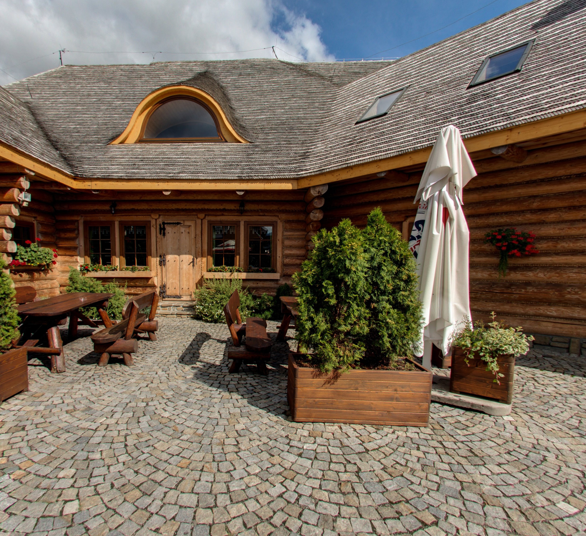
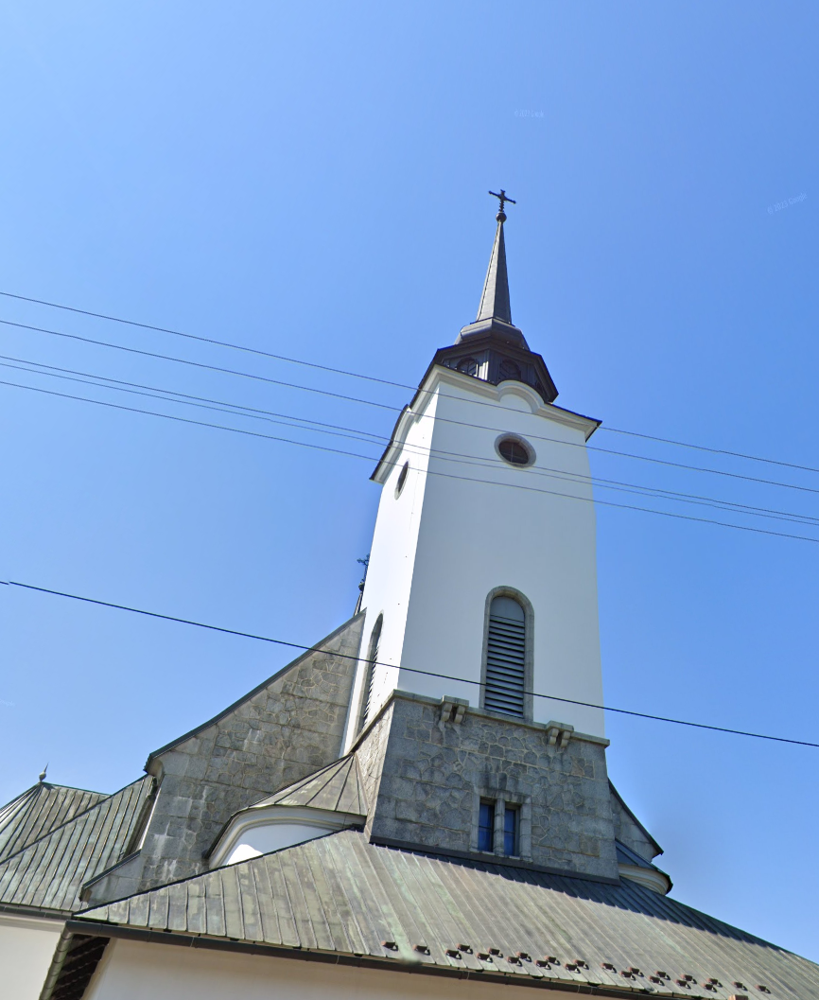
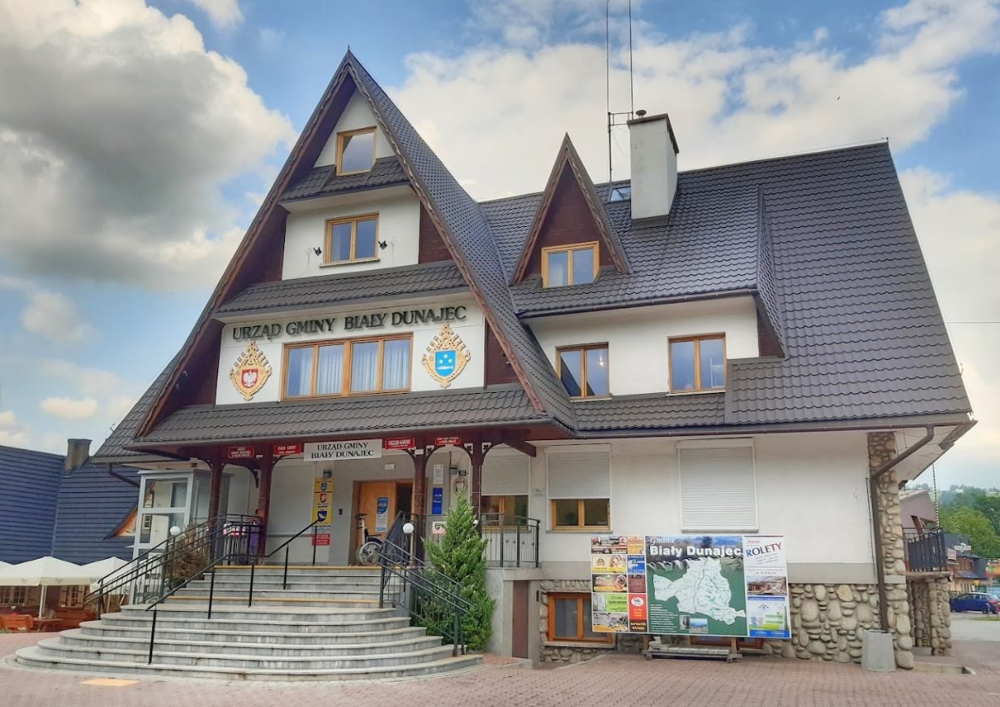
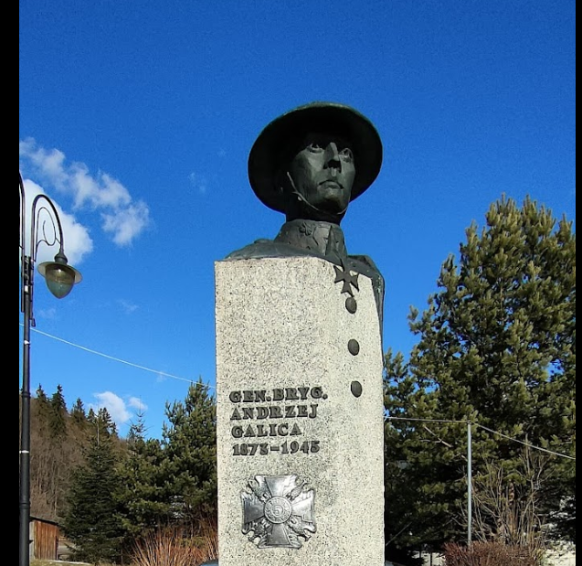
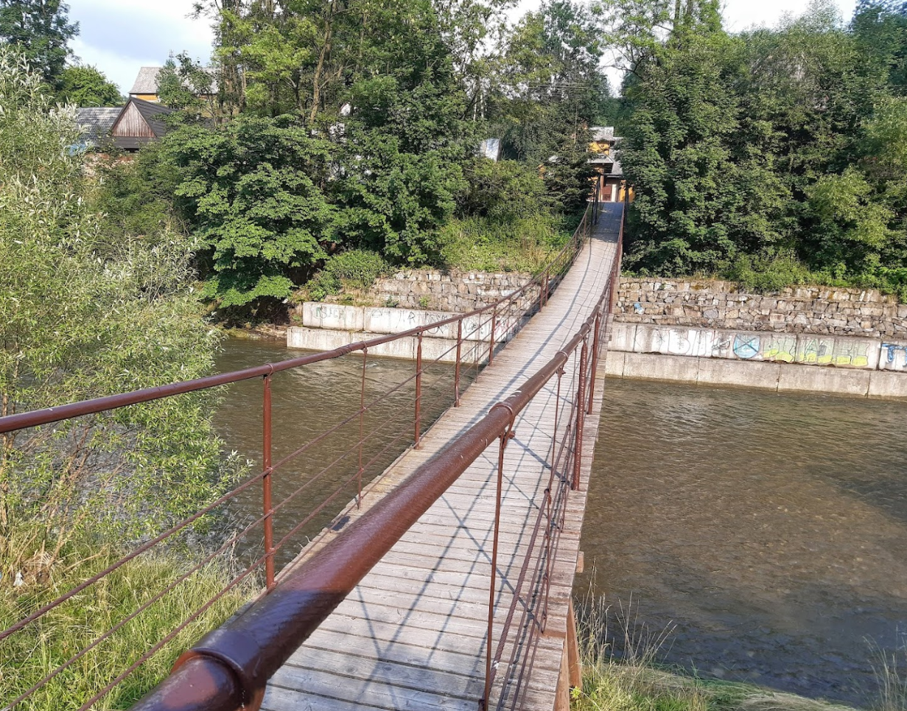
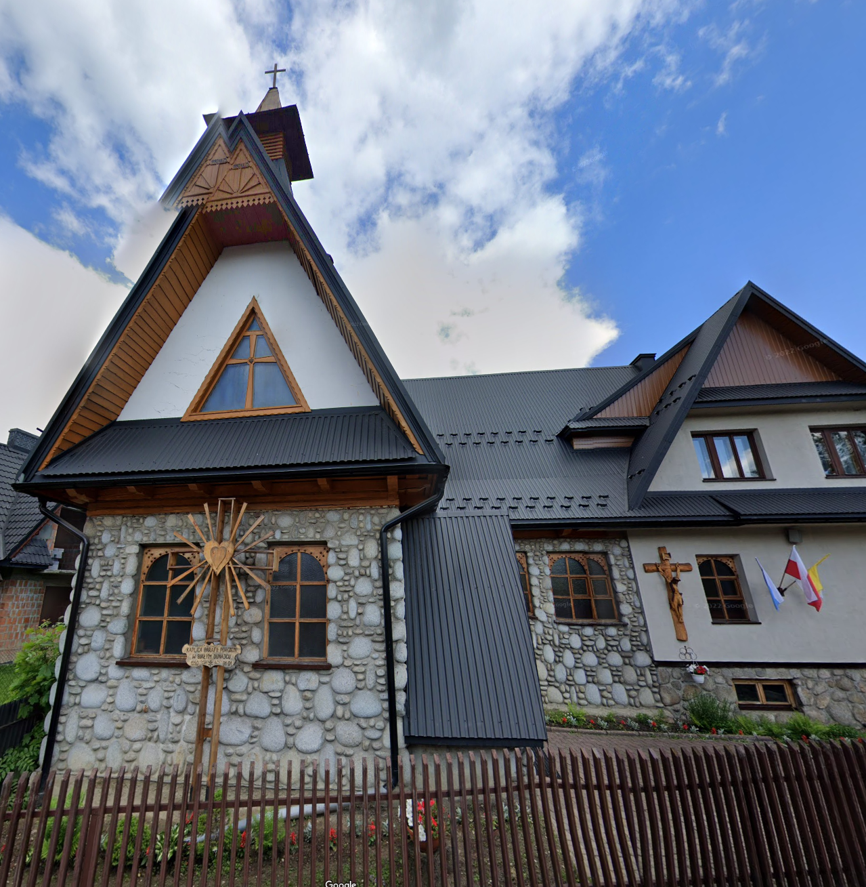
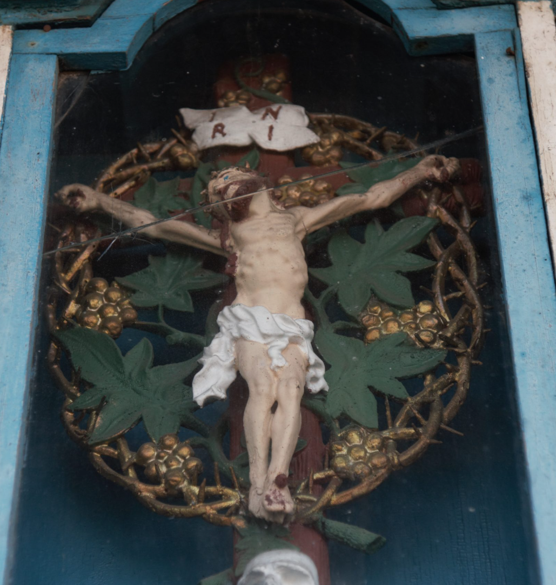
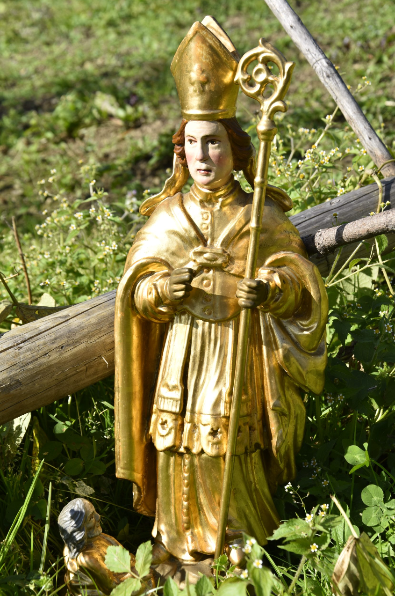
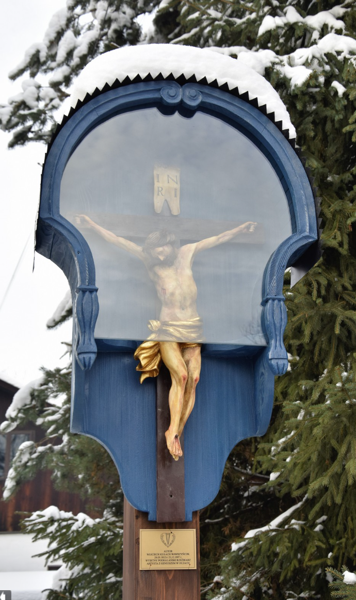

# Zasady Gry
1. Zostaniemy podzieleni na 5 drużyn po ok. 6-7 osób.
2. Każda z drużyn będzie wykonywać zadania z listy.
3. Zadania są pogrupowane w kategorie, za ich wykonanie można zdobyć różną ilość punktów 
4. Każde zadanie jest punktowane: 10, 25, 50 lub nawet 100 punktów, w zależności od trudności.
5. Zadania mogą być związane z zagadkami lub wykonywaniem określonych czynności w okolicach Białego Dunajca.
6. Każde zdjęcie lub filmik musi zawierać numer zadania.
7. Każda z drużyn musi wybrać sobie nazwę i lidera.
8. TYLKO Lider drużyny wysyła zdjęcia przez WhatsApp do Grześka B. 
9.  Jeżeli zadanie będzie zaliczone w konwersacji na WhatsAppie pojawi się 👍 pod zdjęciem.
10. W przypadku remisu decyduje czas nadesłania ostateniego zdjęcia od danej drużyny.

# Zadania
## Zadania za 10 punktów:

1. Zrób zdjęcie całej drużyny przed mostem w Białym Dunajcu.
2. Zdjęcie drużyny "łowiącej ryby" w rzece Biały Dunajec.
3. Zdjęcie drużyny przy tradycyjnej chacie góralskiej.
4. Zdjęcie drużyny na tle panoramy Tatr.

## Zadania za 25 punktów:
 5. Zdjęcie z drużyną pozującą jak "ninja" na tle Kościoła Parafialnego w Białym Dunajcu.
 6. Zrób selfie z "trzema gwiazdkami i rybą". 
 7. Zrób zdjęcie, na którym cała drużyna skacze w powietrzu (żadna noga nie dotyka ziemi).
 
### Znajdź miejsce i prześlij dowód
 8. 
 8. 
 10.  
 11.  
 12.  
 13.  
  
### Rozwiąż zagadkę i wyślij zdjęcie z rozwiązaniem
 14. Kiedy jest używany, ma sześć nóg.
 15. Kiedy przez nie przechodzisz, musisz zdjąć kapelusz.
 16. Nie zadaje pytań, ale czeka na odpowiedź.
 17. Możesz go gdzieś wsadzić, ale nie urośnie. Ma główkę, ale nie myśli.
 18. Możesz to zobaczyć, ale nie możesz tego dotknąć.
 19. Duża kiedy jest nowonarodzona, mała jak umiera.
 20. Jestem mokry, kiedy schnę.
 21. Bez skrzydeł lata, bez oczu płacze.
   

## Zadania za 50 punktów:
  22.    Nawiąż sojusz z inną drużyną i stwórzcie wspólny występ taneczny do polskiej piosenki ludowej (nagrajcie to).
  23.    Znajdź miejsce i wyślij dowód 
- 
## Zadania za 100 punktów
 24.  Nagranie lokalnego mieszkańca opowiadającego o tradycjach góralskich.
 25.  Nagranie lokalnego mieszkańca jak mówi "Biały Dunajec to najpiękniejsze miejsce na ziemi!".
 26.  Fotografia członka drużyny w tradycyjnym stroju góralskim.
 27.  Znajdź co najmniej dwie z trzech rzeźb na szlaku Wojciecha Kułach-Wawrzyńcoka, które znajdują się w Białym Dunajcu 
   
    
   
   